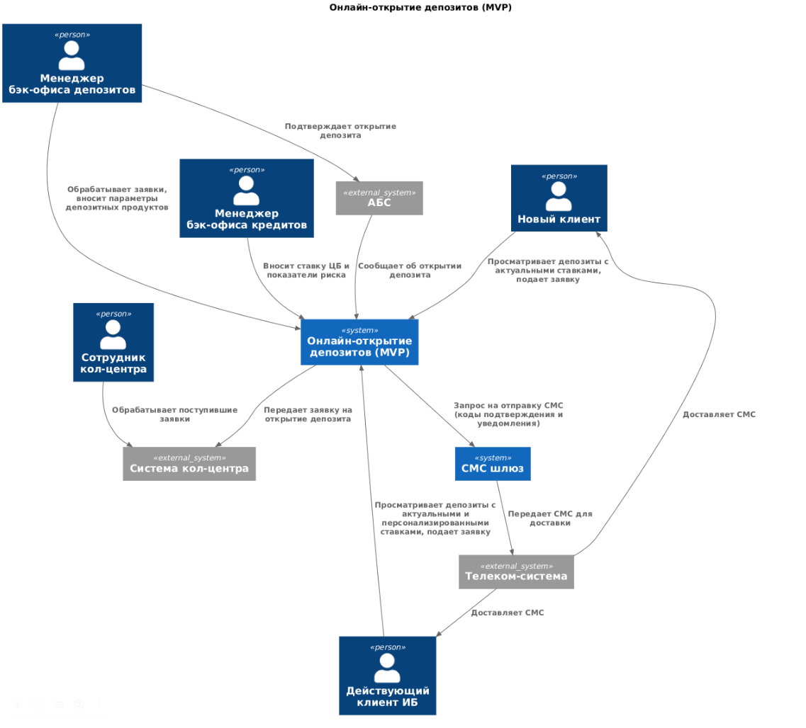
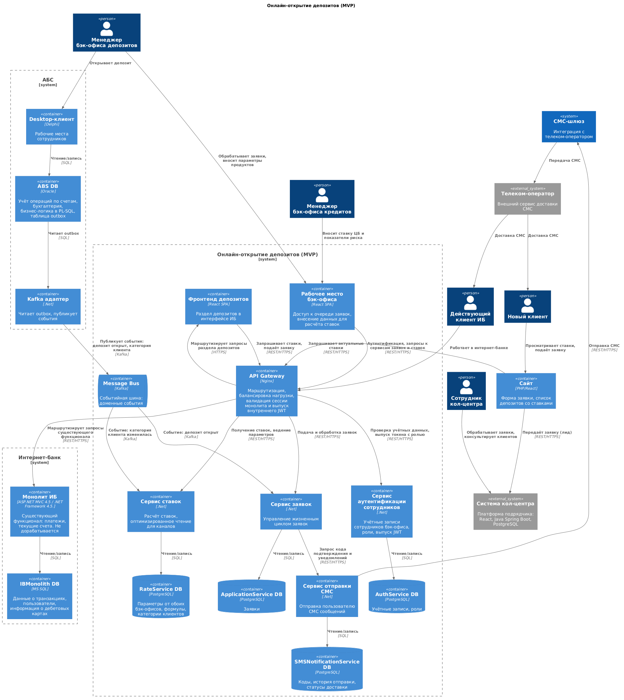

### **Название задачи:** MVP — «Онлайн-открытие депозита»
### **Автор:** Сергеев И. Е.
### **Дата:** 06.08.2026
### **Функциональные требования**
|**№**|**Действующие лица или системы**|**Use Case**|**Описание**|
| :-: | :- | :- | :- |
|UC-1|Клиент, Сайт|Получение списка депозитов|1. Клиент открывает сайт. 2. Сайт запрашивает информацию о депозитах с актуальными ставками. 3. Сайт отображает информацию пользователю.|
|UC-2|Новый клиент, Сайт, Система кол-центра|Подача заявки на открытие депозита|1. Клиент открывает сайт. 2. Вводит данные: номер телефона, Ф. И. О. 3. Сайт отправляет данные в систему кол-центра. 4. Система кол-центра сохраняет заявку. 5. Клиент получает звонок от сотрудника кол-центра. 6. Менеджер может предложить специальные условия.|
|UC-3|Клиент, Интернет-банк|Получение списка депозитов|1. Пользователь заходит в интернет-банк. 2. Интернет-банк получает информацию о депозитах с актуальными и персонализированными ставками. 3. Интернет-банк отображает пользователю информацию о ставках по депозитам.|
|UC-4|Клиент, Интернет-банк|Подача заявки на открытие депозита|1. Клиент указывает счёт и сумму депозита. 2. Отправляет заявку. 3. Подтверждает действие кодом из СМС. 4. Заявка регистрируется в системе для обработки, без прямого обращения к АБС.|
|UC-5|Сотрудник кол-центра, Система кол-центра|Приём и консультация по заявке|1. Получает новую заявку в системе кол-центра. 2. Изучает заявку в системе кол-центра, чтобы предложить пользователю специальные условия. 3. Звонит клиенту. 4. Сообщает клиенту о получении заявки и предлагает специальные условия. 5. Сообщает клиенту о необходимости личного визита в отделение для идентификации и дальнейшего оформления депозита.|
|UC-6|Менеджер бэк-офиса по депозитам, Менеджер бэк-офиса по кредитам, АБС|Обработка заявки и открытие депозита|**Основной поток:** 1. Менеджер видит входящую заявку. 2. Определяет условия ставки по депозиту. 3. Подтверждает депозит в АБС. 4. Депозит открывается в АБС. 5. Клиент получает СМС-уведомление о ставке. 6. Клиент получает СМС-уведомление об открытии.  **Альтернативный поток (специальная ставка):** 2a. Менеджер по депозитам видит большой остаток на счёте клиента. 2b. Согласует кредитные риски по конкретному клиенту с менеджером отдела кредитов. 2c. Рассчитывает специальную ставку по депозиту. 2d. Возвращается в основной поток.|
|UC-7|Менеджер бэк-офиса по депозитам, Менеджер бэк-офиса по кредитам, Единый справочник|Ведение и расчёт ставок|1. Менеджер по кредитам рассчитывает данные о кредитных рисках на основе ставки рефинансирования Центробанка. 2. Записывает эту информацию в справочник. 3. Менеджер по депозитам получает из справочника необходимую информацию по ставкам. 4. Рассчитывает ставки по депозитам на основе этих данных. 5. Записывает эту информацию в справочник. 6. В справочнике поддерживаются актуальные ставки.|
### **Нефункциональные требования**
|**№**|**Требование**|
| :-: | :- |
|NFR-1|Соблюдение принятой в компании системы дизайна: привычные цвета, брендированные элементы. Новый интерфейс переиспользует существующую дизайн-систему банка (U1)|
|NFR-2|Режим работы 24/7 с доступностью 99,9% для всех сервисов депозитного контура, допустимый простой — около 9 часов в год (R1, R2)|
|NFR-3|Отказоустойчивость на уровне ЦОД: при сбое основного ЦОД сервисы остаются доступны на резервном и выдерживают нагрузку (R3)|
|NFR-4|Мониторинг доступности и латентности сервисов, алертинг о сбоях (R4)|
|NFR-5|Отклик по всем операциям — миллисекунды (P1)|
|NFR-6|Устранить медленную загрузку справочных данных при платежах, сейчас более 1 секунды (P2)|
|NFR-7|Равномерное горизонтальное масштабирование и балансировка запросов между серверами, приложениями и ЦОД (P3)|
|NFR-8|Разработка документации для дальнейшего расширения системы (S1)|
|NFR-9|Архитектура поддерживает интеграционное тестирование межсистемных сценариев (S2)|
|NFR-10|Модульность и расширяемость: новый функционал реализуется отдельными сервисами со стабильными контрактами, чтобы развивать систему без переработки существующего функционала (S3)|
|NFR-11|Шифрование трафика во всех клиентских каналах — сайт, интернет-банк (+R1)|
|NFR-12|СМС-функционал дорабатывается силами IT-команды банка, вне ядра системы (+R3)|
|NFR-13|Сегментированный доступ к справочнику ставок: бэк-офис кредитов ведёт показатели риска, бэк-офис депозитов — ставки; доступ к чужому сегменту закрыт (+R4)|
|NFR-14|Приоритет технологий, уже используемых в банке (+R5)|
|NFR-15|Новые технологии допустимы только при совместимости с существующими платформами и наличии экспертизы внутри банка (+R6)|
|NFR-16|Для очередей сообщений использовать Kafka (+R7)|
|NFR-17|Новый функционал строится вне ядра интернет-банка (+R8)|
|NFR-18|Не размещать нагрузочно-критичные данные (справочник ставок) в АБС (+R9)|
|NFR-19|Интернет-банк не работает с API или БД АБС напрямую в новом процессе — только через промежуточный слой (+R11)|
|NFR-20|АБС масштабируется только вертикально, ограничение Oracle-БД (+R12)|
### **Решение**

Исходник: [C4_Context.puml](./C4_Context.puml)

Исходник: [C4_Container.puml](./C4_Container.puml)

#### 1. Вынос депозитного функционала из монолита ИБ

Новый функционал по подаче и обработке заявок на открытие депозита вынесен из монолита ИБ в отдельные сервисы. Добавлен API Gateway, который управляет маршрутизацией (монолит ИБ / новые сервисы депозитов), балансирует нагрузку, валидирует сессию и выпускает внутренний JWT-токен. Добавлен отдельный фронтенд раздела депозитов с соблюдением дизайн-системы, принятой в интерфейсе ИБ.

MVP необходимо запустить в течение 6 месяцев, и разбирать весь монолит целиком, ядро которого принадлежит подрядчику, нецелесообразно. Ядро ИБ дорабатывается только на стороне подрядчика, а этого следует избегать.

Стек монолита (.NET Framework 4.5) технически не позволяет реализовать требуемое: он несовместим с Kafka, которую предписано использовать для очередей сообщений, и не даёт нормального горизонтального масштабирования. Требования по доступности 24/7 и 99,9% в текущем монолите также невыполнимы — он работает на одной группе серверов в одном ЦОД.

API Gateway необходим, потому что при реализации Strangler Fig нужно управлять маршрутизацией между монолитом и новым функционалом, оставаясь бесшовным для пользователя. Он же решает задачу аутентификации: неизвестно, умеет ли монолит выдавать JWT-токены, а новым сервисам они нужны.

#### 2. Аутентификация и авторизация сотрудников бэк-офиса

Минимальный сервис аутентификации сотрудников. Он необходим для разделения функционала между различными менеджерами бэк-офиса, которые работают в сервисе ставок. В этом сервисе хранятся роли (`deposit_manager` / `credit_manager`), он выпускает свой JWT-токен, чтобы сервис ставок мог понять, кто к нему обращается, и позволять работать только с соответствующим функционалом и данными. Проверку прав делает сам сервис ставок, API Gateway только пропускает запросы с валидным токеном.

Есть требование, чтобы сотрудники разных отделов бэк-офиса могли вести свои расчёты и необходимые данные в одном месте, но при этом не имели прямого доступа к «сырым» данным друг друга, а пользовались только результатами расчётов. Это требование безопасности, оно зафиксировано в описании текущего процесса.

*Допущение:* в исходных материалах не описано, как устроена аутентификация сотрудников банка. В целевом состоянии этот сервис можно заменить интеграцией с корпоративной системой аутентификации, тогда появится единый вход, а остальные компоненты менять не придётся.

#### 3. Сервис расчёта ставок

Сервис расчёта ставок. В нём менеджеры бэк-офиса совместно ведут расчёты, которые необходимы для вычисления ставок по депозитам. Также в этом сервисе хранится информация об актуальных ставках, формулы расчёта, категория клиента, которая асинхронно обновляется из АБС.

Сейчас процесс согласования происходит через почту, а сами ставки рассчитываются в Excel, к которому нет доступа ни у ИБ, ни у сайта.

Расчёт внутри сервиса снимает конфликт с требованием безопасности: менеджеры только наполняют сервис своими данными, а комбинирует их и считает ставку он сам. Между сотрудниками разных отделов ничего передавать не нужно, доступом управляет сервис.

Пока данных мало (десятки продуктов), обычная БД отдаёт их за миллисекунды, а отдельная витрина добавляет сложность без выигрыша.

Также сервис и хранящиеся в нём формулы позволяют автоматизировать расчёт специальных предложений для конкретного клиента.

#### 4. Интеграция с АБС через события (Outbox + Kafka)

Введение Kafka-адаптера и применение паттерна Outbox.

Поскольку АБС построена на Oracle с логикой в PL-SQL, напрямую оттуда в Kafka писать нельзя. Поэтому было принято решение развернуть рядом адаптер на более свежем стеке, который работает со специальной таблицей событий в БД АБС и занимается публикацией событий в Kafka.

Применение паттерна Outbox позволит гарантировать, что событие об открытии депозита не потеряется: оно записывается в ту же транзакцию, что и сама операция.

Синхронные обращения запрещены, потому что БД АБС перегружена, масштабируется только вертикально, и её доступность не даёт требуемых 99,9%. События решают это — сервисы получают данные, никого не дёргая. При этом запрет на прямую работу с АБС не нарушается: публикация инициируется самой АБС и не создаёт нагрузки на чтение.

#### 5. Сервис заявок на открытие депозита

Новый сервис, который агрегирует заявки пользователей из ИБ, управляет их жизненным циклом, позволяет менеджеру по депозитам видеть заявки и обрабатывать их. Менеджер работает с очередью заявок через новое рабочее место бэк-офиса, а сам депозит открывает в АБС, как и раньше. Заявка переходит в финальный статус по событию из АБС об открытии депозита — тогда же клиенту уходит уведомление.

Выделить заявки в отдельный сервис продиктовано тем, что АБС и так высоконагруженная система и вводить сущность заявок в неё нельзя. Команда АБС прямо предупреждает, что онлайн-подача заявок может поставить под угрозу работоспособность банка. При таком решении в АБС попадает только финальная операция — открытый депозит, а не весь черновой поток заявок, включая отклонённые и брошенные.

Также надо было избавиться от прямой интеграции ИБ и АБС. Новый сервис заявок позволяет управлять жизненным циклом заявок асинхронно, используя результаты работы АБС.

*Направление развития:* после решения проблемы с БД АБС новые сервисы смогут передавать заявки напрямую, а обработка — автоматизироваться. Это путь к целевому состоянию через год, когда депозит открывается без участия бэк-офиса.

#### 6. Раздельные потоки сайта и интернет-банка

Заявка с сайта и заявка из интернет-банка в MVP не сходятся в один поток. Заявка с сайта — это лид (телефон и Ф. И. О.), она уходит в систему кол-центра, менеджер перезванивает клиенту и направляет его в отделение для идентификации. Заявка из интернет-банка попадает в новый сервис заявок и обрабатывается бэк-офисом. Интеграции системы кол-центра с новым контуром не делаем.

Это два разных по смыслу объекта. Заявка с сайта не содержит ни счёта, ни суммы, а сам клиент ещё не идентифицирован — обрабатывать её так же, как заявку из ИБ, нечем. По регуляторным требованиям новый клиент не может открыть депозит без личной проверки документов в отделении, поэтому его путь всё равно замыкается офлайн.

Система кол-центра работает на платформе подрядчика, любая интеграция с ней потребует его участия. Вкладываться в это ради потока, который стратегически отмирает, нецелесообразно: цель банка — привлечь молодую аудиторию через онлайн, и по мере появления удалённой идентификации необходимость в звонке и визите будет снижаться.

#### 7. Стек новых сервисов и распределение работ по командам

Новые сервисы депозитного контура пишутся на .NET (современная версия, не Framework 4.5) силами внутренней команды интернет-банка. В качестве СУБД для новых сервисов выбран PostgreSQL. Команда АБС делает свою часть — запись событий в outbox из PL-SQL и Kafka-адаптер. Доработка сайта — на команде, которая его сопровождает.

В банке есть экспертиза и в .NET, и в Java, поэтому вопрос был не столько в технологии, сколько в том, какой команде отдать работу.

Команда АБС на первый взгляд выглядит крупнее — 20 человек против 10 внутренних в интернет-банке. Но их Java-компетенция ограничена: в описании сказано, что в команде есть несколько специалистов с опытом в Java-стеке, которые периодически вносят изменения в систему кол-центра. Это не полноценная Java-команда, способная вести новую разработку. Кроме того, команда АБС занята ядром учётной системы банка и в MVP получает собственную задачу по публикации событий.

Команда интернет-банка профильно работает с .NET, знает клиентский контур, его контракты и дизайн-систему, а главное — это внутренние 10 человек, не зависящие от подрядчика. Новый функционал строится вне подрядчицкого ядра, поэтому делать его должны именно они.

PostgreSQL выбран потому, что он уже используется в банке (система кол-центра), не требует лицензионных затрат при горизонтальном масштабировании и хорошо поддерживается .NET-стеком.

---

### **Альтернативы**

**Реализовать работу с депозитами внутри монолита ИБ силами подрядчика.**
Срок зависит от подрядчика, появляется внешняя зависимость в критичном проекте. Главное — на .NET Framework 4.5 технически невозможно реализовать работу с Kafka и горизонтальное масштабирование.

**Размещение справочника ставок в АБС.**
БД АБС перегружена, масштабируется только вертикально, бизнес-логика заперта в PL-SQL.

**Справочник только хранит готовые ставки, расчёт остаётся ручным.**
Не решает проблему скорости: ручной расчёт и согласование через почту остаются узким местом.

**АБС отдаёт API, сервисы синхронно её опрашивают.**
Отвергается из-за нагрузки на перегруженную БД и несовместимости с требованием доступности 99,9%.

**Передавать заявки в АБС.**
Команда АБС прямо предупреждает, что онлайн-поток заявок угрожает работоспособности банка.

**Менеджер подтверждает открытие и в АБС, и в сервисе заявок.**
Отвергнуто из-за двойного ручного ввода и риска рассинхронизации при человеческой ошибке.

**Использовать авторизацию АБС для сотрудников бэк-офиса.**
У АБС нет API аутентификации — это десктопное приложение на Delphi с логикой в PL-SQL. Пришлось бы её дорабатывать, а рабочее место бэк-офиса стало бы зависеть от доступности АБС.

**Реализовать новые сервисы на Java/Spring силами команды АБС.**
Больше людей, стек в банке есть. Отвергнуто: Java-компетенция в команде АБС ограничена несколькими специалистами, работающими эпизодически, команда не знает клиентский контур и загружена сопровождением учётной системы.

---

**Недостатки, ограничения, риски**

- API Gateway становится критически важным узлом системы — требует резервирования, его отказ делает недоступным весь контур.
- Гетерогенность стека: часть функционала остаётся на .NET Framework 4.5, новая часть — на современном .NET.
- Переход в раздел депозитов реализован отдельным фронтендом и может оказаться не полностью бесшовным для пользователя.
- Сотрудник получает вторую учётную запись в дополнение к той, что уже есть у него в АБС, единого входа нет.
- Сервис расчёта ставок становится критичным: от него зависят и клиентские каналы, и бэк-офис.
- Формула расчёта ставок зашита в код, изменение методики требует доработки.
- Категория клиента обновляется асинхронно: клиент, только что пополнивший счёт, может не сразу увидеть персональную ставку.
- Событие из АБС может не дойти — депозит будет открыт, а уведомление клиенту не отправлено. Требуется мониторинг публикации событий.
- Менеджер работает в двух интерфейсах: очередь заявок в новом рабочем месте, открытие депозита в АБС. Возможны человеческие ошибки.
- Половина процесса остаётся ручной: Новые клиенты всё равно идут через звонок и отделение. Эффект MVP будет только для действующих клиентов ИБ.
- Требуется доработка legacy-системы АБС, сроки зависят от загрузки команды АБС.
- Внутренняя команда ИБ — 10 человек, они же сопровождают монолит. Новая разработка конкурирует за ресурс с текущей поддержкой.