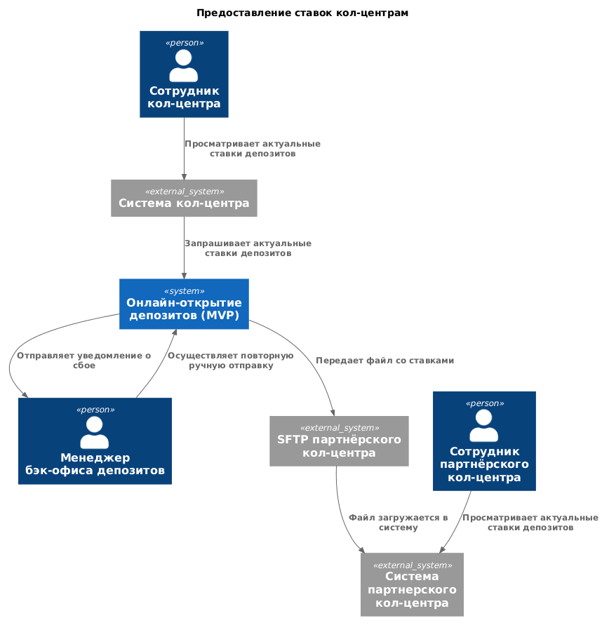
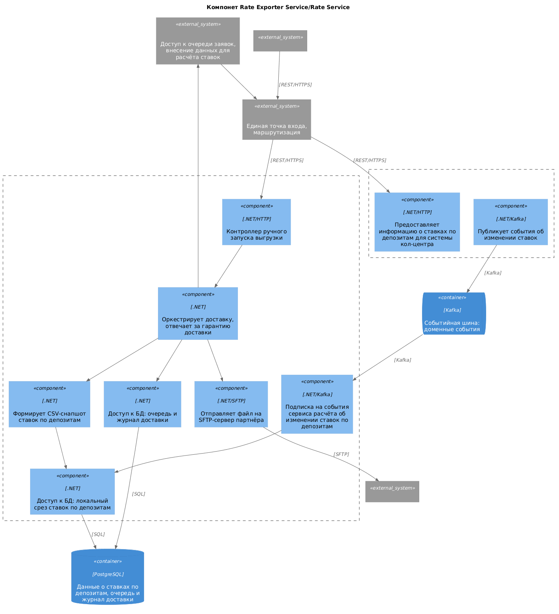

### **Название задачи:** Доступ кол-центров к актуальным ставкам по депозитам
### **Автор:** Сергеев И.Е.
### **Дата:** 09.08.2026
### **Функциональные требования**
|**№**|**Действующие лица или системы**|**Use Case**|**Описание**|
| :-: | :- | :- | :- |
|UC-1|Оператор кол-центра, Система кол-центра|Консультация клиента по текущим ставкам банка|1. Клиент звонит в кол-центр банка. 2. Оператор кол-центра смотрит актуальные ставки по депозитам в системе кол-центра. 3. Озвучивает клиенту актуальные ставки.|
|UC-2|Оператор партнёрского кол-центра, Система партнёрского кол-центра|Консультация клиента по текущим ставкам банка силами партнёрского кол-центра|1. Клиент звонит в партнёрский кол-центр. 2. Оператор смотрит ставки по депозитам, актуальные на момент загрузки последнего файла. 3. Озвучивает клиенту ставки.|
|UC-3|Сервис ставок, SFTP-сервер партнёрского кол-центра|Автоматическая передача файла со ставками в партнёрский кол-центр|**Основной поток:** 1. Сервис ставок публикует событие об обновлении ставок. 2. Компонент выгрузки получает событие и формирует файл с актуальными ставками. 3. Файл передаётся на SFTP-сервер партнёрского кол-центра. 4. Результат отправки фиксируется в журнале.  **Альтернативный поток (сбой доставки):** 3a. При недоступности SFTP-сервера или ошибке передачи выполняются повторные попытки. 3b. Если доставить файл не удалось, в журнал записывается ошибка и формируется алерт менеджеру бэк-офиса депозитов.|
|UC-4|Менеджер бэк-офиса депозитов, Сервис ставок, SFTP-сервер партнёрского кол-центра|Ручная выгрузка файла со ставками|1. Менеджер получает алерт о неуспешной автоматической выгрузке. 2. Открывает раздел управления выгрузкой в рабочем месте бэк-офиса. 3. Запускает выгрузку вручную. 4. Файл формируется и передаётся на SFTP-сервер партнёрского кол-центра. 5. Менеджер видит результат выгрузки, запись добавляется в журнал.|

### **Нефункциональные требования**
|**№**|**Требование**|
| :-: | :- |
|NFR-1|Кол-центрам передаются только публичные ставки по депозитам. Персонализированные ставки за пределы интернет-банка не выходят|
|NFR-2|Оператор кол-центра банка видит ставки, актуальные на момент обращения|
|NFR-3|Партнёрский кол-центр располагает актуальным и корректным файлом со ставками. Допустимая задержка от момента обновления ставок не более 5 минут|
|NFR-4|При невозможности автоматической доставки ответственный сотрудник уведомляется и может запустить выгрузку повторно|
|NFR-5|Партнёрская система кол-центра является внешней и не может быть доработана: интеграция возможна только через файловый обмен|
|NFR-6|Файл передаётся партнёру по защищённому каналу. Сам файл не шифруется: ставки публичны, а расшифровка потребовала бы доработок на стороне партнёра|
|NFR-7|Решение должно выдерживать возросший поток обращений в кол-центры после запуска маркетинговой кампании|
|NFR-8|Доработки выполняются на существующем стеке банка, новые технологии не вводятся|
|NFR-9|Для очередей сообщений используется Kafka|
|NFR-10|Доступность сервисов 24/7 на уровне 99,9%|
### **Решение**

Исходник: [C4_Context.puml](./C4_Context.puml)

Исходник: [C4_Components.puml](./C4_Components.puml)

#### 1. Доступ кол-центра банка к сервису ставок

На стороне подрядчика дорабатывается синхронное получение актуальных ставок из сервиса расчёта ставок. Оператор видит ставки в своём привычном интерфейсе.

Подрядчик может дорабатывать своё решение под наши требования, система кол-центра имеет возможности для расширения.

Синхронный вызов гарантирует актуальность данных, нет необходимости синхронизировать и хранить копию ставок на стороне кол-центра.

Вызовы идут через API Gateway и используют сервис аутентификации, поэтому сервис расчёта ставок контролирует доступ к данным: по роли клиента отдаются только публичные ставки.

На стороне подрядчика можно реализовать кэширование ставок, поскольку они меняются нечасто, это снимет нагрузку при возросшем потоке обращений.

#### 2. Сервис экспорта ставок и доставка файла партнёрскому кол-центру

Отдельный микросервис на .NET и PostgreSQL, который занимается выгрузкой ставок в партнёрский кол-центр.

**Почему отдельный сервис.** Чтобы не смешивать интеграционную обвязку с доменной логикой расчёта ставок. Сервис расчёта занимается ставками, а не форматами файлов, SFTP-соединениями и очередями доставки.

**Механика.** Сервис подписывается на события об обновлении ставок в Kafka. В событии приходит полный набор актуальных ставок, поэтому синхронно ходить в сервис расчёта не нужно: сервис обновляет локальный срез и генерирует из него CSV-снапшот.

Дальше этому снапшоту присваивается имя в соответствии с контрактом, который мы согласовываем с партнёрским кол-центром: `deposit_rates_<timestamp>.csv`. По timestamp партнёр понимает, какой файл свежий, и не берёт в обработку один и тот же файл дважды.

Чтобы партнёр не подхватил недогруженный файл, публикация сделана атомарной. Файл заливается под временным именем и переименовывается в финальное только после того, как передача завершилась. Временные имена партнёр игнорирует.

Сервис экспорта должен гарантировать доставку. Для этого он ведёт очередь исходящих файлов со статусами, а воркер по расписанию забирает недоставленные и повторяет попытки с экспоненциальными ретраями. Все попытки пишутся в журнал доставок. Если попытки исчерпаны, менеджеру бэк-офиса депозитов уходит уведомление, и он может переотправить файл руками из своего рабочего места.

Отдельно про идемпотентность: специально её реализовывать не пришлось. В событии приходит полный набор ставок, локальный срез перезаписывается целиком, а повторно доставленный файл содержит тот же снапшот. Дедупликация не нужна.

Файл передаётся по SFTP, канал шифруется на уровне протокола. Сам файл дополнительно не шифруем: ставки публичны, а расшифровка потребовала бы доработок на стороне партнёра, о готовности к которым мы ничего не знаем. Вместо этого усиливаем контроль доступа: аутентификация по SSH-ключам, партнёр ограничен своим каталогом.

**Почему снапшот, а не инкремент.** Ставки рассчитываются по продуктам, а их у банка немного, так что снапшот получается небольшим. Усложнять логикой инкрементального обновления нецелесообразно, проще перезаписать целиком. Каждый файл самодостаточен: если одну выгрузку пропустили, следующая полностью восстановит состояние, и партнёру не нужно ничего сливать между собой.

---

### **Альтернативы**

**Собственный срез ставок на стороне подрядчика с синхронизацией через Kafka.**
Подрядчику пришлось бы поднимать своё хранилище и подписку на нашу шину, доработка получается сложнее и дороже.
Появляется вторая копия данных и задача поддерживать её в актуальном состоянии.

**Отдельное окно со ставками вместо доработки системы кол-центра.**
Оператор работал бы в двух интерфейсах, при этом система кол-центра расширяема и доработка возможна.

**Добавление функционала выгрузки в сервис расчёта ставок.**
Не смешиваем интеграционную обвязку с доменной логикой. Сервис расчёта занимается ставками, а не форматами файлов, SFTP-соединениями и очередями доставки.

**Выгрузка по расписанию вместо выгрузки по событию.**
Файл может оставаться неактуальным до суток.

**Инкрементальная выгрузка вместо снапшота.**
При таком объёме данных усложнение не оправдано, а партнёру пришлось бы реализовывать логику слияния изменений.

**Почта как канал доставки файла.**
Незащищённый канал и ручная операция на стороне партнёра.

**Шифрование самого файла (PGP) поверх SFTP.**
Ставки не являются чувствительными данными, они публикуются банком на сайте, поэтому защиты канала достаточно.
Кроме того, расшифровка потребовала бы доработок на стороне партнёра.

---

**Недостатки, ограничения, риски**

- Зависимость от подрядчика: сроки и стоимость доработки системы кол-центра определяются им, своих специалистов с нужной экспертизой у банка мало.
- API Gateway становится точкой отказа для всего контура.
- При недоступности сервиса расчёта ставок оператор кол-центра останется без актуальных данных.
- Ещё один сервис в поддержке.
- Доставка файла зависит от доступности SFTP-сервера партнёра: банк контролирует только формирование файла, повторные попытки и уведомление.
- При длительной недоступности партнёрского сервера операторы работают со старыми ставками.
- Контракт обмена (формат и имя файла) согласован с внешней стороной, его изменение требует договорённости.
- Локальный срез ставок в сервисе экспорта это ещё одна копия данных, при потере события он устареет, пока не придёт следующее.
- Основной объём работ ложится на команду интернет-банка (10 человек внутри банка), которая параллельно сопровождает монолит. Требуется усиление команды или последовательное выполнение задач.

## Команда интернет-банка (10 человек внутри банка)

**Инфраструктура нового контура**
- Развернуть API Gateway: маршрутизация между монолитом ИБ и новыми сервисами, балансировка нагрузки
- Реализовать валидацию сессии монолита и выпуск внутреннего JWT токена(идентификатор клиента ИБ)
- Развернуть Kafka

**Сервис аутентификации сотрудников**
- Реализовать хранение учётных записей сотрудников бэк-офиса и ролей
- Реализовать выпуск JWT токена с указанием ролей
- Добавить роль для системы кол-центра

**Сервис расчёта ставок**
- Реализовать хранение параметров депозитных продуктов и показателей риска(с разграничением доступа)
- Внедрить расчёт ставок по формуле
- Реализовать хранение категории клиента и внедрить расчёт персонализированных ставок
- Добавить подписку на события АБС (открытие депозита, изменение категории клиента)
- Реализовать API получения ставок для клиентских каналов
- Реализовать API получения публичных ставок для внешних потребителей
- Настроить публикацию события об обновлении ставок(полный набор актуальных данных)

**Сервис заявок**
- Реализовать приём заявок из интернет-банка и жизненный цикл заявки
- Реализовать очередь заявок для обработки бэк-офисом
- Реализовать закрытие заявки по событию об открытии депозита
- Реализовать инициацию СМС-уведомлений

**Сервис отправки СМС**
- Реализовать отправку кодов подтверждения и уведомлений через СМС-шлюз
- Реализовать хранение кодов и истории отправки

**Сервис экспорта ставок**
- Развернуть новый сервис и инфраструктуру под него
- Реализовать подписку на событие об обновлении ставок и ведение локального среза
- Реализовать формирование CSV-снапшота по согласованному контракту
- Реализовать очередь исходящих файлов со статусами и журнал доставки
- Реализовать воркер доставки: повторные попытки с экспоненциальной задержкой
- Реализовать SFTP-клиент с атомарной публикацией файла
- Реализовать API ручного запуска выгрузки и уведомление о неуспешной доставке

**Фронтенд депозитов**
- Реализовать раздел депозитов в интерфейсе ИБ с соблюдением дизайн-системы
- Реализовать отображение ставок, подачу заявки и подтверждение СМС-кодом

**Рабочее место бэк-офиса**
- Реализовать очередь заявок и обработку заявки менеджером
- Реализовать внесение параметров депозитных продуктов и показателей риска с разграничением по ролям
- Добавить раздел управления выгрузкой ставок партнёру, отображение уведомлений о сбоях и повторный запуск

**Сайт**
- Добавить отображение списка депозитов с актуальными ставками
- Добавить форму подачи заявки (телефон, Ф. И. О.)
- Реализовать передачу заявки в систему кол-центра

## Команда АБС (20 человек)

- Реализовать запись событий в таблицу outbox из PL-SQL: открытие депозита, изменение категории клиента
- Добавить Kafka-адаптер: чтение outbox и публикация событий

## Подрядчик системы кол-центра (команда сопровождения, 5 человек)

- Реализовать приём заявок с сайта
- Добавить в интерфейс оператора раздел с актуальными ставками по депозитам
- Реализовать обращение к сервису расчёта ставок через API Gateway
- Добавить аутентификацию как сервисного клиента и хранение учётных данных
- Настроить кэширование ставок на своей стороне

## Партнёрский кол-центр (внешняя команда)

- Согласовать контракт обмена: формат файла, состав полей, правила именования, признак завершённости передачи
- Предоставить доступ к SFTP-серверу, обменяться ключами, согласовать сетевой доступ
- Реализовать приём файла и загрузку ставок в свою систему

## Команда цифровой трансформации (10 человек)

- Согласовать с подрядчиком системы кол-центра объём и сроки доработок
- Согласовать с партнёрским кол-центром регламент обмена: периодичность обновления, действия при недоставке, контакты для эскалации
- Обеспечить перенос ведения ставок из Excel в сервис расчёта, обучить бэк-офис работе в новом рабочем месте

### **RoadMap**
Исходник: [RoadMap_bank_Standart.drawio](./RoadMap_bank_Standart.drawio)
